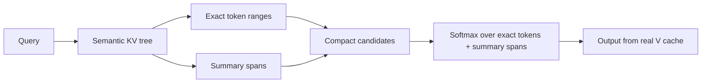

# Attention Experiments

Research prototype for **score-only Tree Attention** for long-context decode. The tree is used to route and approximate attention scores over long KV caches; values still come from the real token `V` cache, not from learned or averaged tree values.

<p align="center">
  <b>Dense attention</b> scores every token. <b>Score-only Tree Attention</b> scores exact ranges plus summary spans.
</p>



## Current result

The current best Kaggle/T4 path is the **v69 compact score-pack** implementation:

- CUDA tree selector emits exact ranges and summary spans.
- Summary spans use one score for `[start:end)`.
- Summary values use prefix sums of real `V`: `sum_v = prefix_v[end] - prefix_v[start]`.
- Compact attention runs over `exact_tokens + summary_spans`, not over the full context length.

Kaggle T4 synthetic decode benchmark, `query_len=8`, `heads=8`, `kv_heads=2`, `head_dim=64`, threshold `0.35`:

| seq len | dense ms | tree ms | speedup | output cosine | selector ms | compact attention ms | mean physical scores |
|---:|---:|---:|---:|---:|---:|---:|---:|
| 64k | 2.240 | 2.716 | 0.825x | 0.98617 | 1.037 | 1.173 | 370.6 |
| 128k | 3.812 | 3.361 | 1.134x | 0.97960 | 1.047 | 1.811 | 564.8 |
| 256k | 6.612 | 5.138 | 1.287x | 0.98357 | 1.081 | 3.521 | 1163.8 |
| 512k | 8.090 | 5.569 | 1.453x | 0.98340 | 0.987 | 4.050 | 2021.8 |

This is a promising research result, not a production result. It shows the method can beat dense decode at long context on a T4, but quality has not yet been validated on real model tasks.

## Can this replace Gemma attention without fine-tuning?

Yes, technically: for decode, the attention output can be replaced layer-by-layer using the existing model weights and KV cache. No retraining is required to try it because the approximation changes only the attention computation, not the model parameters.

But it is not guaranteed to preserve model quality. The required quality gate is:

- compare logits/perplexity on real continuations;
- compare greedy generation against dense attention;
- run retrieval/needle/long-context QA tasks;
- measure which layers tolerate replacement;
- measure tree build/update cost, not only decode attention cost.

Use `experiments/evaluate_gemma_tree_attention_quality.py` for a first real-model check on a local or cached Hugging Face Gemma-like model.

## What is inside

- Semantic tree over KV keys.
- Range-bound selector with CPU and CUDA paths.
- Score-only summary-span semantics:

  ```text
  denom += length * exp(summary_score)
  out   += exp(summary_score) * V[start:end].sum(dim=0)
  ```

- Compact CUDA candidate/score packing kernels.
- Gemma-like GQA helpers for comparing dense vs tree attention from real Q/K/V tensors.
- Kaggle/T4 benchmark notebooks and scripts.

## Architecture docs

- [English architecture](docs/architecture_en.md)
- [Русская архитектура](docs/architecture_ru.md)
- [Score-only Tree Attention report](docs/score_only_tree_attention_report.md)

## Quick start

```bash
python -m venv .venv
source .venv/bin/activate
pip install -r requirements.txt
pytest -q
```

Synthetic benchmark:

```bash
python experiments/benchmark_tree_attention.py --device cpu --retrieval --seq-lens 65536 --trials 1 --selection-mode range_bound --range-distance-threshold 0.75
```

Layer-local Gemma-like probe:

```bash
python experiments/benchmark_gemma_tree_attention.py \
  --model /path/to/local/gemma \
  --device cuda \
  --max-new-tokens 4 \
  --range-distance-threshold 0.35
```

End-to-end replacement quality smoke test:

```bash
python experiments/evaluate_gemma_tree_attention_quality.py \
  --model /path/to/local/gemma \
  --device cuda \
  --prompt "The capital of France is" \
  --continuation " Paris. It is known for the Eiffel Tower." \
  --max-new-tokens 8
```

## Status

Experimental. The current result is strong enough to justify real-model quality evaluation and CUDA cleanup, but not enough to claim production readiness.
