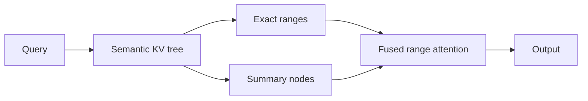

# Attention Experiments

Research prototype for **tree-routed long-context attention**: organize the KV cache as a semantic tree, retrieve relevant token ranges, summarize far regions, and run attention only over the selected context.

<p align="center">
  <b>Dense global attention</b> reads everything. <b>Tree Attention</b> reads the parts that matter.
</p>



## What is inside

- Semantic tree over KV keys.
- Range-bound traversal using node radius.
- Contiguous semantic KV layout for block reads.
- Optional CUDA range-attention kernel.
- Kaggle/T4 benchmarks for long-context retrieval experiments.

## Architecture docs

- [English architecture](docs/architecture_en.md)
- [Русская архитектура](docs/architecture_ru.md)

## Current direction

The project explores whether long global context can be approximated with:

```text
attention cost ≈ selected exact tokens + summary nodes
```

instead of scoring every token in the full context. The current prototype focuses on finding important tokens and measuring retrieval quality before integrating into a real decoder model.

## Quick start

```bash
python -m venv .venv
source .venv/bin/activate
pip install -r requirements.txt
pytest -q
```

Run a benchmark:

```bash
python experiments/benchmark_tree_attention.py --device cpu --retrieval --seq-lens 65536 --trials 1 --selection-mode range_bound --range-distance-threshold 0.75
```

## Status

Experimental. The code is intended for research and profiling, not production inference yet.
