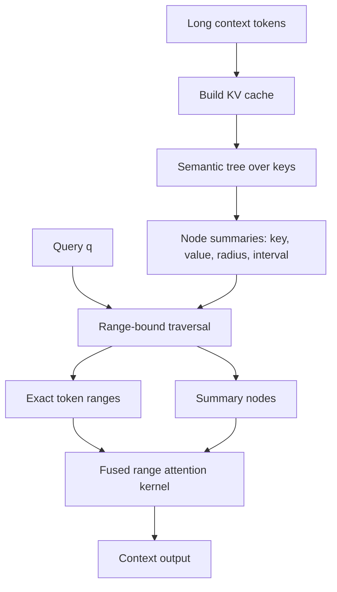
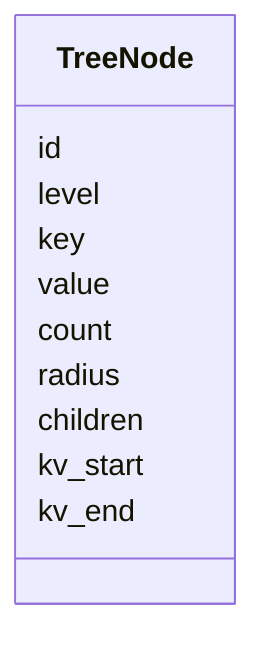
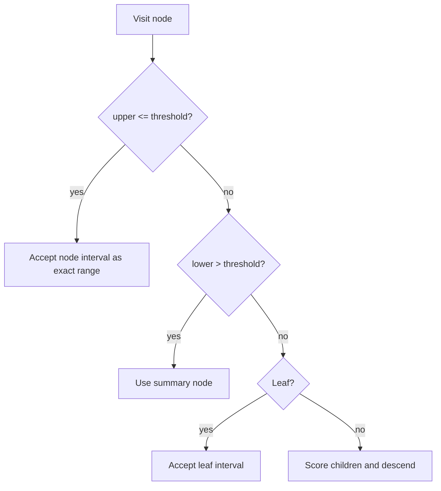
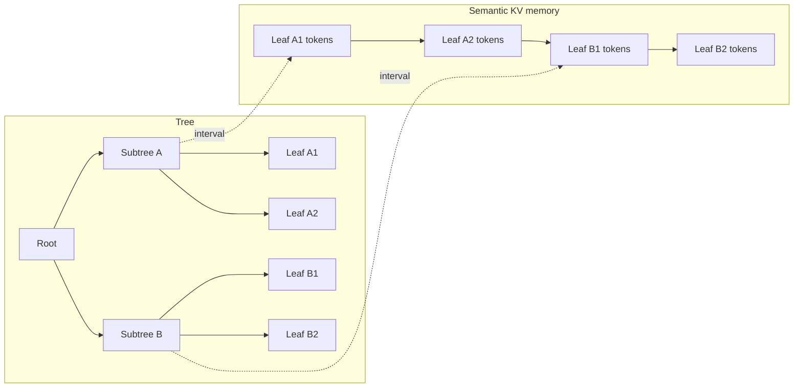
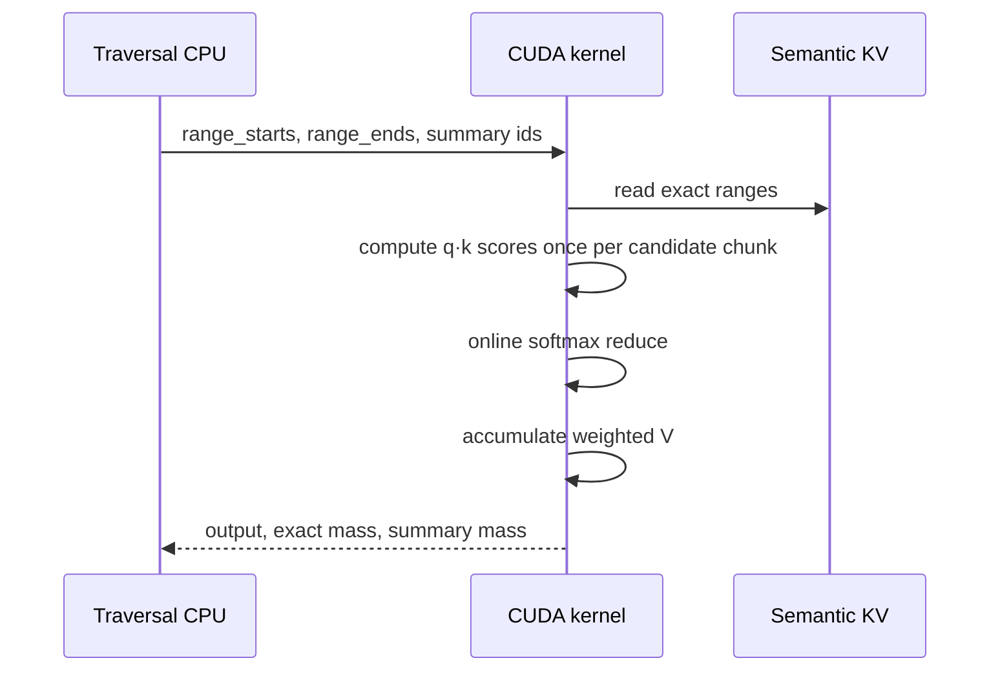

# Architecture: Tree Attention for Long Context

The goal of this project is to replace full global attention over the whole KV cache with hierarchical retrieval over relevant token regions. Instead of reading every one of the `N` keys, the model builds a tree over the KV cache, descends into similar regions, and uses summary nodes for pruned subtrees.

## Core idea

Standard attention for one query does:

```text
q @ K[0:N] -> softmax -> weighted sum V[0:N]
```

This is accurate, but expensive for long context. Tree Attention organizes the KV cache as a semantic tree:

- leaves store real tokens;
- internal nodes store one summary key, one summary value, count, and radius;
- radius estimates how far subtree tokens may be from the node key;
- traversal selects exact ranges plus summary nodes.

## High-level pipeline



## Tree node

Each node represents a region in key-space and a contiguous interval in the semantic KV layout.



Field meanings:

- `key` — routing/summary key for the region;
- `value` — summary value for all tokens below the node;
- `radius` — upper bound for how far subtree keys can be from the node key;
- `kv_start`, `kv_end` — contiguous interval in the reordered KV cache;
- `children` — child semantic subregions.

## Range-bound traversal

For query `q`, traversal computes distance to the node key. The radius gives two bounds:

```text
upper = distance(q, node.key) + node.radius
lower = distance(q, node.key) - node.radius
```

Rules:

1. `upper <= threshold` — the whole region is close enough, accept the full interval as exact tokens.
2. `lower > threshold` — the whole region is far, replace the subtree with its summary value.
3. Otherwise, descend into children.



## Semantic KV layout

After tree construction, the KV cache is reordered into DFS/semantic order. This makes each subtree a contiguous range, so the kernel can read memory in blocks.



This matters for GPUs: pointer arrays to random tokens are inefficient in VRAM, while intervals enable coalesced/block reads.

## Attention kernel

The current CUDA prototype accepts:

```text
q                 [Q, D]
k, v              semantic KV layout
range_starts/ends [Q, R]
summary_k/v       [Q, S, D/V]
summary_counts    [Q]
```

The kernel computes online softmax over exact ranges plus summary nodes without materializing selected K/V with `torch.cat`.



## Current result

On a T4 microbenchmark for a 256k-like workload:

```text
candidate_tokens       9639
ranges                 36
summaries              57
kernel_ms              ~0.35-0.37 ms
torch_materialized_ms  ~0.38-0.43 ms
```

The first naive kernel was slow because it recomputed `q·k` for every `V` column. The chunked kernel computes scores once and is roughly 75x faster than the naive version.

## Why this can scale

Dense attention reads and scores all `N` tokens. Tree Attention aims for:

```text
build:     O(N log N) offline / amortized
traversal: O(visited_nodes)
attention: O(selected_tokens + summary_tokens)
```

If selected tokens grow slower than `N`, global context becomes cheaper than dense attention for long contexts.

## Limitations and next steps

This is a research prototype:

- traversal is still mostly CPU-side;
- traversal should move to GPU using flat node tables;
- softmax mass for pruned subtrees needs better estimation;
- the method must be tested inside a real decoder model, not only synthetic retrieval.

Next GPU layout:

```text
node_key
node_radius
child_start / child_count
children_flat
kv_start / kv_end
```

With that layout, traversal can generate ranges directly on GPU without a Python loop on the query path.
