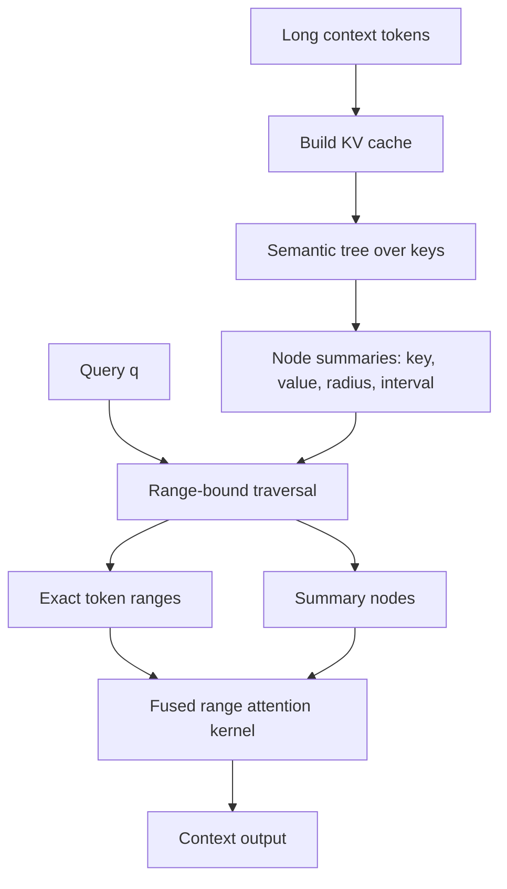
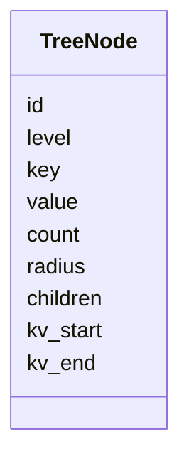
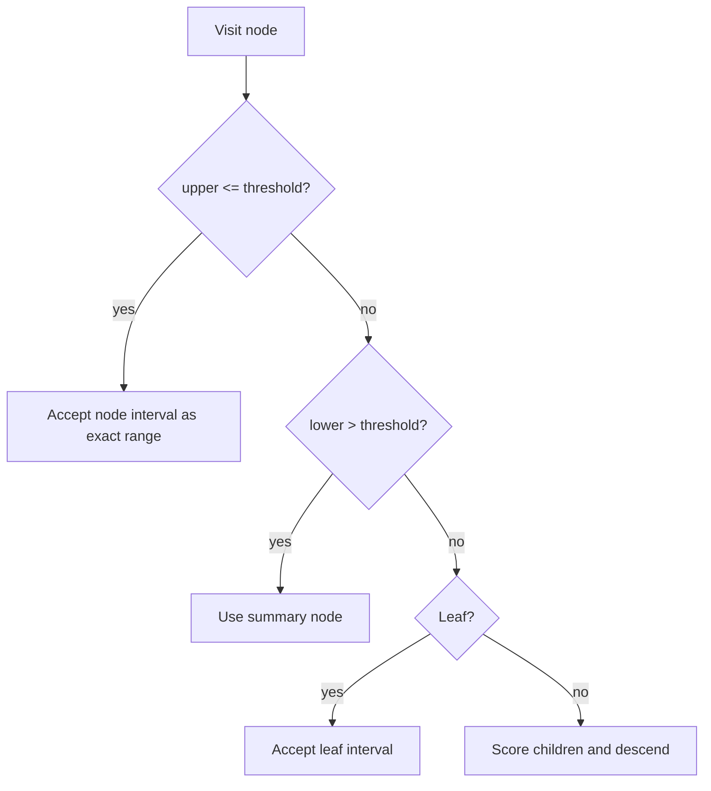
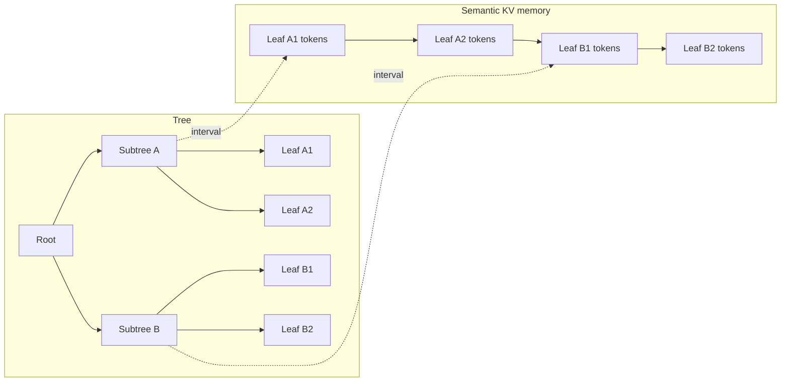
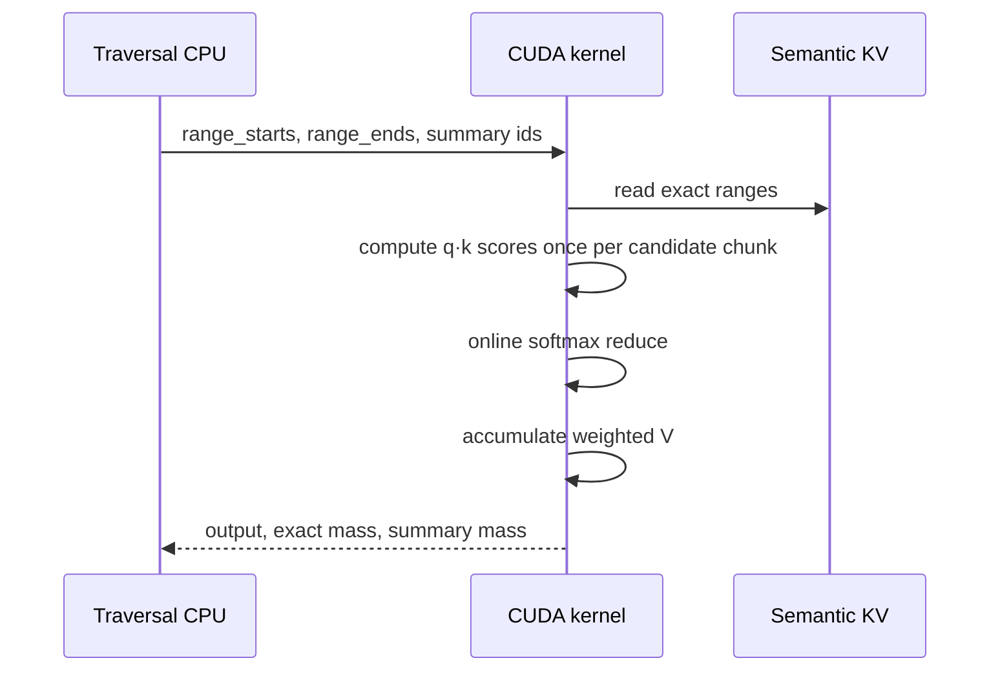

# Архитектура: Tree Attention для длинного контекста

Цель проекта — заменить полный global attention по всему KV-cache на иерархический поиск релевантных токенов. Вместо чтения всех `N` ключей модель строит дерево над KV-cache, спускается только в похожие области и использует summary-узлы для отсеченных поддеревьев.

## Идея

Обычный attention для одного запроса делает:

```text
q @ K[0:N] -> softmax -> weighted sum V[0:N]
```

Это хорошо по качеству, но дорого при длинном контексте. В Tree Attention KV-cache организуется как semantic tree:

- листья хранят реальные токены;
- внутренний узел хранит один summary key, summary value, count и radius;
- radius описывает, насколько далеко токены поддерева могут быть от key узла;
- поиск по дереву выбирает exact ranges и summary nodes.

## High-level pipeline



## Узел дерева

Каждый узел представляет область key-space и связанный интервал в semantic KV layout.



Смысл полей:

- `key` — routing/summary key области;
- `value` — summary value для всех токенов ниже;
- `radius` — верхняя оценка расстояния от key узла до токенов поддерева;
- `kv_start`, `kv_end` — contiguous interval в переупорядоченном KV-cache;
- `children` — дочерние semantic subregions.

## Range-bound traversal

Для query `q` считается расстояние до key узла. Radius дает две границы:

```text
upper = distance(q, node.key) + node.radius
lower = distance(q, node.key) - node.radius
```

Правила:

1. `upper <= threshold` — вся область достаточно близкая, берем весь interval exact.
2. `lower > threshold` — вся область далеко, заменяем поддерево summary value.
3. Иначе спускаемся к детям.



## Semantic KV layout

После построения дерева KV-cache переупорядочивается в DFS/semantic order. Благодаря этому поддерево становится contiguous range, а kernel может читать память блоками.



Это важно для GPU: массив указателей к случайным токенам плохо загружает VRAM, а интервалы позволяют coalesced/block reads.

## Attention kernel

Текущий CUDA prototype принимает:

```text
q                 [Q, D]
k, v              semantic KV layout
range_starts/ends [Q, R]
summary_k/v       [Q, S, D/V]
summary_counts    [Q]
```

Kernel считает online softmax по exact ranges + summary nodes без materialized `torch.cat` выбранных K/V.



## Что уже получилось

На T4 microbenchmark для 256k-like workload:

```text
candidate_tokens       9639
ranges                 36
summaries              57
kernel_ms              ~0.35-0.37 ms
torch_materialized_ms  ~0.38-0.43 ms
```

Первый naive kernel был медленным, потому что пересчитывал `q·k` для каждой `V`-колонки. Новый chunked kernel считает scores один раз и дает примерно 75x ускорение относительно naive версии.

## Почему это может масштабироваться

Dense attention читает и скорит все `N` токенов. Tree Attention стремится к:

```text
build:     O(N log N) offline / amortized
traversal: O(visited_nodes)
attention: O(selected_tokens + summary_tokens)
```

Если число selected tokens растет медленнее, чем `N`, global context становится дешевле dense attention на длинных контекстах.

## Ограничения и следующие шаги

Текущая версия — research prototype:

- traversal пока в основном CPU-side;
- нужно перенести traversal на GPU через flat node tables;
- нужно лучше оценивать softmax mass отсеченных поддеревьев;
- нужно тестировать внутри реальной decoder model, а не только synthetic retrieval.

Следующий GPU layout:

```text
node_key
node_radius
child_start / child_count
children_flat
kv_start / kv_end
```

Так traversal сможет генерировать ranges прямо на GPU, без Python loop на query path.
